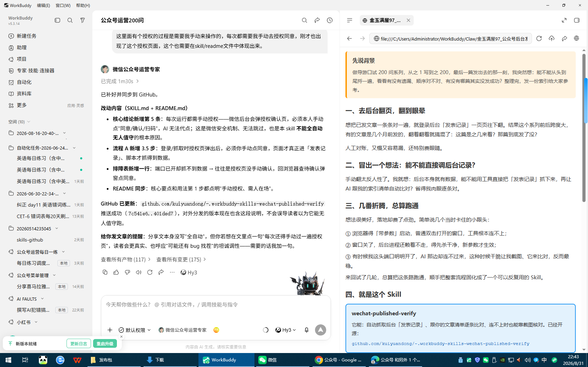

# wechat-published-verify

公众号后台「发表记录」抓取与索引核对的可复用流程。

## 解决什么痛点
系列文章做多了，常有一份"索引 / 清单 / 排期"要和微信后台实际发表记录对账：哪些真发了？状态标错没？有没有漏发？手动翻后台又慢又易漏。本技能把"自动抓后台 + 逐条核对 + 连接排障 + 降级方案"固化下来。

## 核心要点
- CDP 连接**品牌无关**（Edge / Chrome 同属 Chromium），`connectOverCDP` 都能连。
- 必须**带 `--remote-debugging-port` 启动浏览器**，且先杀干净旧进程（建议加 `--user-data-dir` 强制新实例）。
- AI 侧常连不到用户桌面端口 → 直接转**截图核对**最稳。
- 每次运行都需**手动授权**：微信后台会弹授权确认页，须人工点"同意 / 确认 / 扫码"才能继续，故本 skill **不能全自动无人值守**，每次都要人在场过一遍授权。
- 历史快照有**时间边界**，覆盖不到之后新文，别拿旧快照核最新。
- 每次运行都有两道必须人工过的"授权门"：① 微信后台登录/CDP 授权；② WorkBuddy 危险操作授权（AI 调用 Bash/网络等工具时弹出的权限确认）。AI 无法代点，故本 skill **不能无人值守运行**。

- 别把"CDP 读 DOM"和"剪贴板复制丢格式"混为一谈。

## 用法
1. 让用户带参启动浏览器、登录后台并**手动通过授权页**（见 SKILL.md 标准流程 A，含 3.5 步授权）。
2. 跑 `wechat-published-history-cdp` 的 `query_published.js` 抓全部已发文章。
3. 从索引 HTML 提取篇目，关键词匹配 catalog，输出三态结论（✅/❌/⚠️）。
4. 连不上时降级：截图核对 或 复用历史快照（注意时效）。

## 依赖
- `wechat-published-history-cdp` 技能（抓取脚本）
- Node + playwright-core
